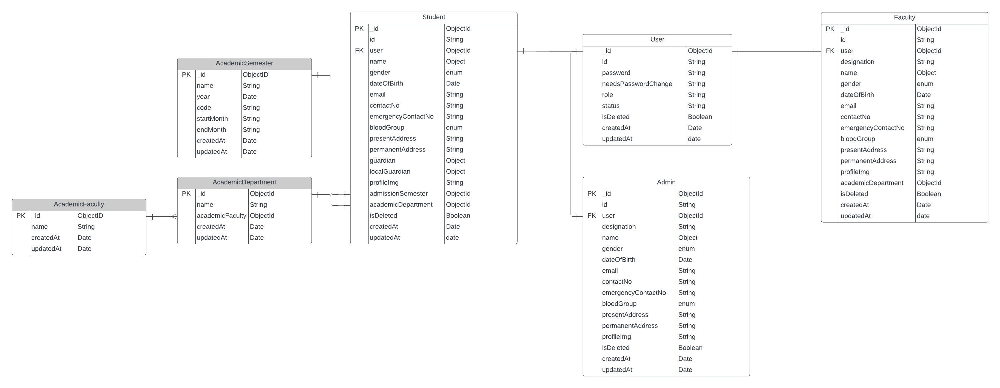
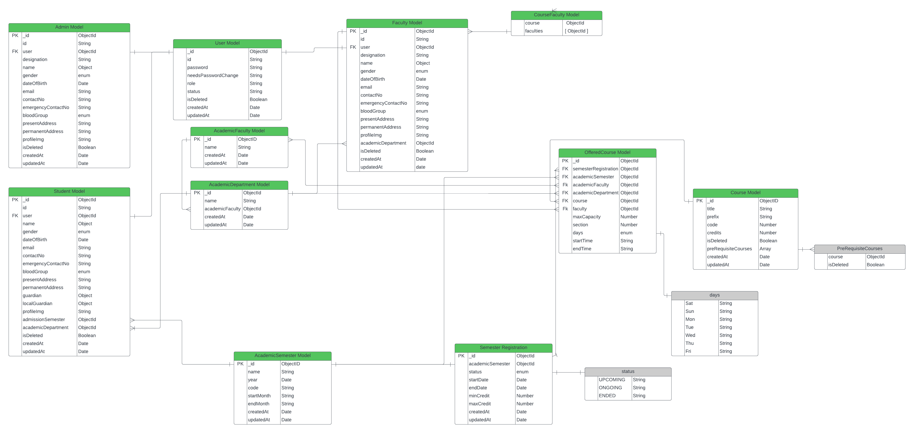

# NoSQL Brainiac

- [Part 1 - Branch: `first-project-3`](#part-1---branch-first-project-3)
  - [Introduction](#introduction)
  - [Mongoose: Static vs Method](#mongoose-static-vs-method)
  - [Global Error Handler and Unhandled Routes](#global-error-handler-and-unhandled-routes)
- [Part 2 - Branch: `first-project-4`](#part-2---branch-first-project-4)
  - [Higher Order Function](#higher-order-function)
  - [Refactoring Zod validation](#refactoring-zod-validation)
  - [Utils vs Middlewares\*\*\*\*](#utils-vs-middlewares)
- [Part 3 - Branch: `first-project-5`](#part-3---branch-first-project-5)
  - [Global Error and Not Found Handler - Simplified Example)](#global-error-and-not-found-handler---simplified-example)
  - [Understanding Zod validation Basic](#understanding-zod-validation-basic)
  - [Populate](#populate)
  - [MongoDB Query Execution Order](#mongodb-query-execution-order)
  - [Postscript of Part-3](#postscript-of-part-3)
- [Part 4 - Branch: `first-project-6`](#part-4---branch-first-project-6)
  - [`uncaughtException` error and `unhandledRejection`](#uncaughtexception-error-and-unhandledrejection)
  - [`Global QueryBuilder to search, sort, filter, paginate and select`](#global-querybuilder-to-search-sort-filter-paginate-and-select)
- [Part 5 - Branch: `first-project-7`](#part-5---branch-first-project-7)
  - [`$pull` and `$in` in MongoDB](#pull-and-in-in-mongodb)

[Requiremnet-Analysis](https://docs.google.com/document/d/10mkjS8boCQzW4xpsESyzwCCLJcM3hvLghyD_TeXPBx0/edit?usp=sharing)

[ER Diagram: basic](./Final.png)



[ER Diagram: Detailed](./erdiagram.png)



# Part 1 - Branch: `first-project-3`

## Table of Contents

- [Introduction](#introduction)
- [Mongoose: Static vs Method](#mongoose-static-vs-method)
- [Global Error Handler and Unhandled Routes](#global-error-handler-and-unhandled-routes)

## Introduction

**SQL:** Sequential Query Language (Oracle, MySQL). Collection, Document, Field

**NoSQL:** No Sequential Query Language (mogoDB, mariaDB, Radis, DynamoDB) Table, Row, Column(Field)

## Mongoose: Static vs Method

In Mongoose, **statics** and **methods** serve different purposes despite both being used to define reusable functions for schemas. The main difference lies in **how** they are used and the **context** in which they operate.

| **Feature**  | **Statics**                                                                                         | **Methods**                                                                                 |
| ------------ | --------------------------------------------------------------------------------------------------- | ------------------------------------------------------------------------------------------- |
| **Context**  | Operates on the**model/class level** (e.g., `Student`).                                             | Operates on the**instance/document level** (e.g., a specific student).                      |
| **Use Case** | For operations that do not require a specific document (e.g., queries, aggregations, or utilities). | For operations related to a specific document (e.g., modifying a property, checking state). |
| **Access**   | Accessed via the**model** (e.g., `Student.findByAge(age)`).                                         | Accessed via the**instance** (e.g., `studentInstance.isAdult()`).                           |

#### **When to Use** `Statics`

Use `statics` when the operation involves the **entire collection** or the model as a whole, and does not pertain to a specific document.

#### Example: Static Method for Finding Documents by Age

```javascript
studentSchema.statics.findByAge = async function (age) {
  return await this.find({ age });
};

// Usage:
const students = await Student.findByAge(18);
```

**When to Use** `Methods`

Use `methods` when the operation involves **an individual document** or needs to modify/work with specific document fields.

#### Example: Method to Check if a Student is an Adult

```javascript
studentSchema.methods.isAdult = function () {
  return this.age >= 18;
};

// Usage:
const student = await Student.findOne({ name: 'John' });
console.log(student.isAdult()); // true or false
```

#### **Key Decision Criteria**

1. **Does the function involve one document or many?**
   - **One Document:** Use a `method`.
   - **Multiple Documents or the Model Itself:** Use `statics`.
2. **Do you need access to instance properties (**`**this**`**) like** `**this.age**` **or** `**this.name**`**?**
   - **Yes:** Use a `method`.
   - **No:** Use `statics`.
3. **Is the operation generic to the model or specific to an instance?**
   - **Generic:** Use `statics`.
   - **Specific to an Instance:** Use `methods`.

## Global Error Handler and Unhandled Routes

```javascript
// Catch-all for unhandled routes
app.use((req, res, next) => {
  const error = new AppError('Route not found', 404);
  next(error);
});

// Global Error Handler
app.use((err, req, res, next) => {
  console.error(err.stack);
  res
    .status(err.status || 500)
    .json({ error: { message: err.message || 'Internal Server Error' } });
});
```

# Part 2 - Branch: `first-project-4`

## Table of Contents

- [Higher Order Function](#higher-order-function)
- [Refactoring Zod validation](#refactoring-zod-validation)
- [Utils vs Middlewares](#utils-vs-middlewares)

## Higher Order Function

```javascript
import { NextFunction, Request, RequestHandler, Response } from 'express';

const catchAsync = (fn: RequestHandler) => {
  return (req: Request, res: Response, next: NextFunction) => {
    Promise.resolve(fn(req, res, next)).catch((err) => next(err));
  };
};

export default catchAsync ;
```

The above function `catchAsync` is a higher order function that takes a function as parameter `fn` and returns `fn` if the `fn` returns the Promise or returns the error.

Now we are passing a async request handler as the param of `catchAsync` function

```javascript
const getSingleStudent = catchAsync(async (req, res) => {
  const { studentId } = req.params;
  const result = await StudentServices.getSingleStudentFromDB(studentId);

  sendResponse(res, {
    statusCode: httpStatus.OK,
    success: true,
    message: 'Student is retrieved succesfully',
    data: result,
  });
});

export const StudentControllers = {
  getAllStudents,
  getSingleStudent,
  deleteStudent,
};
```

The `getSingleStudent` is used in the below middleware where the returned function from `catchAsync` is invoked:

```javascript
router.get('/:semesterIdId', StudentControllers.getSingleStudent);
```

## Refactoring Zod validation

In general we use the zoi validation like:

```javascript
import { StudentServices } from './student.service';
import studentValidationSchema from './student.validation';

const createStudent = async (req: Request, res: Response) => {
  try {
    const studentData = req.body;
    const zodParsedData = studentValidationSchema.parse(studentData);
    const result = await StudentServices.createStudentIntoDB(zodParsedData);
  /...
  } catch (err: any) {
  /...
  }
}
```

We aim to refactor the the `Zod` validation with a middleware, so that we can invoke a single middleware function instead of writing the Schema.Parse multiple times.

First create the `Zod` validation Schema

**student.validation.ts**

```javascript
export const createStudentValidationSchema = z.object({
  body: z.object({
    password: z.string().max(20),
    student: z.object({
      name: userNameValidationSchema,
      gender: z.enum(['male', 'female', 'other']),
      //....
      guardian: guardianValidationSchema,
      localGuardian: localGuardianValidationSchema,
      //....
    }),
  }),
});
```

Next we have to write the middleware function.

**middlewares\\validateRequest.ts**

```javascript
import { NextFunction, Request, Response } from 'express';
import { AnyZodObject } from 'zod';
const validateRequest = (schema: AnyZodObject) => {
  return async (req: Request, res: Response, next: NextFunction) => {
    try {
      // validation check
      //if everything allright next() ->
      await schema.parseAsync({
        body: req.body,
      });
      next();
    } catch (err) {
      next(err);
    }
  };
};
export default validateRequest;
```

Now we can call `validateRequest` any route, before the server execution

```javascript
router.post(
  '/create-student',
  validateRequest(createStudentValidationSchema),
  UserControllers.createStudent,
);
```

or, for another `createAcdemicSemesterValidationSchema` we can reuse the `validateRequest`

```javascript
router.post(
  '/create-academic-semester',
  validateRequest(createAcdemicSemesterValidationSchema),
  AcademicSemesterControllers.createAcademicSemester,
);
```

## Utils vs Middlewares

**Utils:** Utils are the reusable functions used in controllers. The global Util functions will be kept in util folder. And module based util function will be kept in `module_name.utils.ts` file.

**Middlewares:** Middlewares are the function essentially used in http requests. The middleware functions will be kept in `middlewares` folder.

# Part 3 - Branch: `first-project-5`

## Table of Contents

- [Global Error and Not Found Handler - Simplified Example)](#global-error-and-not-found-handler---simplified-example))
- [Understanding Zod validation Basic](#understanding-zod-validation-basic)
- [Populate](#populate)
- [MongoDB Query Execution Order](#mongodb-query-execution-order)
- [Postscript of Part-3](#postscript-of-part-3)

## Global Error and Not Found Handler - Simplified Example

```javascript
const express = require('express');
const app = express();

// Route that throws an error
app.get('/', (req, res, next) => {
  const error = new Error('Something went wrong!');
  next(error);
});

// Global 404 Not Found Handler (MUST come after all routes)
app.use((req, res, next) => {
  res.status(404).json({ message: 'Route not found' });
});

// Global Error Handler (MUST have 4 params)r
app.use((err, req, res, next) => {
  res.status(500).json({ message: err.message });
});

// Start the server
app.listen(3000, () => {
  console.log('Server running on port 3000');
});
```

**How Not Found Handler Works:**

- If no route matches the request, Express goes to this middleware.
- It catches all unknown routes.
- Sends a `404` status with a `"Route not found"` message.

**How Error Handler Works:**- The `/` route throws an error using `next(error)`.

- Express skips other middlewares and goes to the error handler.
- The global error handler sends a `500` status with the error message.

## Understanding Zod validation Basic

```javascript
const createAcdemicSemesterValidationSchema = z.object({
  body: z.object({
    name: z.enum([...AcademicSemesterName] as [string, ...string[]]),
    year: z.string(),
    code: z.enum([...AcademicSemesterCode] as [string, ...string[]]),
    startMonth: z.enum([...Months] as [string, ...string[]]),
    endMonth: z.enum([...Months] as [string, ...string[]]),
  }),
});
```

**1. What if** **`name`** **isnΓÇÖt passed?**

- Since `name` is **not marked as optional**, it is **required by default**.
- If omitted, Zod will throw this error:

```json
{
  "statusCode": 400,
  "message": "Validation Error",
  "errorDetails": [{ "path": ["body", "name"], "message": "Required" }]
}
```

**2. What if** `name` **value is invalid (e.g.,** `"Spring"`**)**

- If name is passed but doesnΓÇÖt match the enum, Zod will throw:

```json
{
  "statusCode": 400,
  "message": "Validation Error",
  "errorDetails": [
    {
      "path": ["body", "name"],
      "message": "Invalid enum value. Expected 'Autumn' | 'Summar' | 'Fall', received 'Spring'"
    }
  ]
}
```

**Optional Tip:**

```javascript
name: z.enum([...AcademicSemesterName] as [string, ...string[]], {
  required_error: 'Semester name is required',
  invalid_type_error: 'Semester name must be a string',
})
```

## Populate

In **Mongoose** , the `.populate()` method is used to **automatically replace a referenced ID** in a document with the **actual data** from the related collection.

This is useful when youΓÇÖre working with **MongoDB references (ObjectId)** and want to fetch related documents without writing separate queries.

**Example:**

Suppose you have two collections:

**Book**

```javascript
_id: "book123",
title: "Learn JavaScript",
author: "author456"  // Reference to Author collection
}
```

**Author**

```javascript
{
_id: "author456",
name: "John Doe"
}
```

**Mongoose Models:**

```javascript
const mongoose = require('mongoose');

const authorSchema = new mongoose.Schema({ name: String });

const bookSchema = new mongoose.Schema({
  title: String,
  author: { type: mongoose.Schema.Types.ObjectId, ref: 'Author' },
});

const Author = mongoose.model('Author', authorSchema);
const Book = mongoose.model('Book', bookSchema);

const getAllBooks = async () => {
  const books = await Book.find().populate('author');
  return books;
};
```

**Output (after `.populate()`):**

```javascript
[
  {
    _id: 'book123',
    title: 'Learn JavaScript',
    author: { _id: 'author456', name: 'John Doe' },
  },
];
```

## MongoDB Query Execution Order

MongoDB executes query operations in a fixed logical orderΓÇöfiltering, sorting, skipping, limiting, and projectingΓÇöregardless of the sequence you write them in code.

**Execution Flow**

1. **Filter** : Select documents based on criteria
2. **Sort** : Order the filtered documents
3. **Skip** : Skip a specified number of documents
4. **Limit** : Limit the number of documents returned
5. **Projection** : Include or exclude specific fields from the result

**Example (How Mongoose Translates)**

```javascript
await Product.find(
  { category: 'electronics', inStock: true },
  { name: 1, price: 1, _id: 0 },
)
  .sort({ price: 1 })
  .skip(10)
  .limit(5)
  .lean();
```

This Mongoose query translates to the following MongoDB logic:

```javascript
db.products
  .find(
    { category: 'electronics', inStock: true }, // Filter
    { name: 1, price: 1, _id: 0 }, // Projection
  )
  .sort(
    { price: 1 }, // Sort
  )
  .skip(
    10, // Skip
  )
  .limit(
    5, // Limit
  );
```

Even though `.limit()` is written before `.sort()` in some code, **MongoDB always executes sort first, then limit** .

## Postscript of Part-3

- `findOne()` is a shortcut for `find().limit(1)` under the hood.
- It is **recommended** to use `$set` when updating documents to ensure only the intended fields are modified:

  ```javascript
  Student.findOneAndUpdate(
    { id },
    {
      $set: {
        'name.firstName': 'Mezba',
        'guardian.fatherOccupation': 'Teacher',
      },
    },
    { new: true, runValidators: true },
  );
  ```

- Validators do **not** run by default during the following update operations:

  - `Model.updateOne()`
  - `Model.updateMany()`
  - `Model.findOneAndUpdate()`
  - `Model.findByIdAndUpdate()`

  To enable validation in these cases, you must explicitly pass:

  ```javascript
  {
    runValidators: true;
  }
  ```

# Part 4 - Branch: `first-project-6`

## Table of Contents

- [`uncaughtException` error and `unhandledRejection`](#uncaughtexception-error-and-unhandledrejection)
- [`Global QueryBuilder to search, sort, filter, paginate and select`](#global-querybuilder-to-search-sort-filter-paginate-and-select)

## `uncaughtException` error and `unhandledRejection`

`uncaughtException` → **Synchronous errors**

- Catches **synchronous** errors that are not caught using `try/catch`.
- Also catches **async errors thrown outside promises** , like in `setTimeout`.

**Example (Synchronous):**

```javascript
process.on('uncaughtException', (err) => {
  console.log('Caught:', err.message);
});

throw new Error('This is a synchronous uncaught exception');
```

**Example (Async but not in Promise):**

```javascript
setTimeout(() => {
  throw new Error('Still uncaught by promise');
}, 100);
```

`unhandledRejection` → **Asynchronous (Promise) errors**

- Catches **asynchronous promise rejections** that are **not handled** with `.catch()` or `try/catch`.

```javascript
process.on('unhandledRejection', (reason) => {
  console.log('Caught unhandled rejection:', reason);
});

Promise.reject('This is an unhandled promise rejection');
```

## Global QueryBuilder to search, sort, filter, paginate and select

```javascript
import { FilterQuery, Query } from 'mongoose';

class QueryBuilder<T> {
  public modelQuery: Query<T[], T>;
  public query: Record<string, unknown>;

  constructor(modelQuery: Query<T[], T>, query: Record<string, unknown>) {
    this.modelQuery = modelQuery;
    this.query = query;
  }


  search(searchableFields: string[]) {
    const searchTerm = this?.query?.searchTerm;
    if (searchTerm) {
      this.modelQuery = this.modelQuery.find({
        $or: searchableFields.map(
          (field) =>
            ({
              [field]: { $regex: searchTerm, $options: 'i' },
            }) as FilterQuery<T>,
        ),
      });
    }

    return this;
  }

  filter() {
    const queryObj = { ...this.query }; // copy

    // Filtering
    const excludeFields = ['searchTerm', 'sort', 'limit', 'page', 'fields'];

    excludeFields.forEach((el) => delete queryObj[el]);

    this.modelQuery = this.modelQuery.find(queryObj as FilterQuery<T>);

    return this;
  }


  sort() {
    const sort =
      (this?.query?.sort as string)?.split(',')?.join(' ') || '-createdAt';
    this.modelQuery = this.modelQuery.sort(sort as string);

    return this;
  }

  paginate() {
    const page = Number(this?.query?.page) || 1;
    const limit = Number(this?.query?.limit) || 10;
    const skip = (page - 1) * limit;

    this.modelQuery = this.modelQuery.skip(skip).limit(limit);

    return this;
  }


  fields() {
    const fields =
      (this?.query?.fields as string)?.split(',')?.join(' ') || '-__v';

    this.modelQuery = this.modelQuery.select(fields);
    return this;
  }
}

export default QueryBuilder;
```

**Example Query:**

```javascript
/students?searchTerm=john&age=23&sort=name.firstName,-age&page=2&limit=5&fields=name,email

//the query returns
this.query = {
  searchTerm: 'john', // serach
  age: '23', //filter
  sort: 'name.firstName,-age', //sort
  page: '2',
  limit: '5',
  fields: 'name,email' //select
};
```

`search` **method**

```javascript
search(searchableFields: string[]) {
  const searchTerm = this?.query?.searchTerm;
  if (searchTerm) {
    this.modelQuery = this.modelQuery.find({
      $or: searchableFields.map(
        (field) =>
          ({
            [field]: { $regex: searchTerm, $options: 'i' },
          }) as FilterQuery<T>,
      ),
    });
  }

  return this;
}
```

Generated query fragment:

```javascript
{
  $or: [
    { email: { $regex: 'john', $options: 'i' } },
    { 'name.firstName': { $regex: 'john', $options: 'i' } },
    { presentAddress: { $regex: 'john', $options: 'i' } },
  ];
}
```

`filter ` **method**

```javascript
filter() {
  const queryObj = { ...this.query };
  const excludeFields = ['searchTerm', 'sort', 'limit', 'page', 'fields'];
  excludeFields.forEach((el) => delete queryObj[el]);
  this.modelQuery = this.modelQuery.find(queryObj as FilterQuery<T>);
  return this;
}

```

Generated query fragment (after excluding searchTerm, sort, etc.):

```javascript
{
  age: '23';
}
```

`sort  ` **method**

```javascript
sort() {
  const sort =
    (this?.query?.sort as string)?.split(',')?.join(' ') || '-createdAt';
  this.modelQuery = this.modelQuery.sort(sort as string);
  return this;
}

```

Generated query fragment:

```javascript
.sort('name.firstName -age')

```

`paginate` **method**

```javascript
paginate() {
  const page = Number(this?.query?.page) || 1;
  const limit = Number(this?.query?.limit) || 10;
  const skip = (page - 1) * limit;

  this.modelQuery = this.modelQuery.skip(skip).limit(limit);
  return this;
}

```

Generated query fragment:

```javascript
.skip(5).limit(5)
// page = 2, limit = 5 → skip = (2 - 1) * 5 = 5

```

`fields ` **method**

```javascript
fields() {
  const fields =
    (this?.query?.fields as string)?.split(',')?.join(' ') || '-__v';
  this.modelQuery = this.modelQuery.select(fields);
  return this;
}


```

Generated query fragment:

```javascript
.select('name email')

```

**Combined Final Query:**

```javascript
Student.find({
  $or: [
    { email: { $regex: 'john', $options: 'i' } },
    { 'name.firstName': { $regex: 'john', $options: 'i' } },
    { presentAddress: { $regex: 'john', $options: 'i' } },
  ],
  age: '23',
})
  .sort('name.firstName -age')
  .skip(5)
  .limit(5)
  .select('name email')
  .populate('admissionSemester')
  .populate({
    path: 'academicDepartment',
    populate: { path: 'academicFaculty' },
  });
```

## Part 5 - Branch: `first-project-7`

## Table of Contents

- [`$pull` and `$in` in MongoDB](#pull-and-in-in-mongodb)
- [`$addToSet` and `$each` in MongoDB](#addtoset-and-each-in-mongodb)

## `$pull` and `$in` in MongoDB

`$pull`
The `$pull` operator in **MongoDB** is a powerful update operator used to remove all instances of a specified value or values from an **array**. This operator is particularly useful for modifying arrays within documents without retrieving and updating the entire array manually.

**MongoDB $pull Operator**

- `$pull` **operator** in [**MongoDB**](https://www.geeksforgeeks.org/mongodb-tutorial/) is used to remove all instances of a specified value or values from an array within a document.
- It can also be used for nested arrays, making it a versatile tool.
- If the **$pull operator** is unable to find the desired value, it returns the original array and makes no changes to it

**Syntax**

```javascript
{ $pull: { \<field1>: \<value|condition>, \<field2>: \<value|condition>, ... } }
```

**Examples of $pull Operator**

```
{
  "_id": 1,
  "name": "Alice",
  "skills": ["JavaScript", "Python", "Java"]
},
{
  "_id": 2,
  "name": "Bob",
  "skills": ["JavaScript", "Java", "C++"]
},
{
  "_id": 3,
  "name": "Charlie",
  "skills": ["Python", "Ruby", "JavaScript"]
}
```

Example: Removing a Specific Skill

Let's Remove the skill "Java" from all contributors who have it.

```
db.contributor.updateMany(
  { skills: "Java" },
  { $pull: { skills: "Java" } }
)
```

\***\*Output:\*\***

```
{
  "_id": 1,
  "name": "Alice",
  "skills": ["JavaScript", "Python"]
},
{
  "_id": 2,
  "name": "Bob",
  "skills": ["JavaScript", "C++"]
},
{
  "_id": 3,
  "name": "Charlie",
  "skills": ["Python", "Ruby", "JavaScript"]
}
```

**`$in` operator:**

**Example Document:**

```javascript
[
  { _id: 1, name: 'Apple' },
  { _id: 2, name: 'Banana' },
  { _id: 3, name: 'Cherry' },
  { _id: 4, name: 'Date' },
];
```

Query Using `$in`

```javascript
db.fruits.find({
  name: { $in: ['Apple', 'Cherry'] },
});
```

**What It Does:**

This finds all documents where the `name` field is either `"Apple"` **or** `"Cherry"`.

Output:

```javascript
[
  { _id: 1, name: 'Apple' },
  { _id: 3, name: 'Cherry' },
];
```

## `$addToSet` and `$each` in MongoDB

`$addToSet`

The [`$addToSet`](https://www.mongodb.com/docs/manual/reference/operator/update/addToSet/#mongodb-update-up.-addToSet) operator adds a value to an array unless the value is already present, in which case [`$addToSet`](https://www.mongodb.com/docs/manual/reference/operator/update/addToSet/#mongodb-update-up.-addToSet) does nothing to that array.

**Examples**

Create the `inventory` collection:

```javascript
db.inventory.insertOne({
  _id: 1,
  item: 'polarizing_filter',
  tags: ['electronics', 'camera'],
});
```

The following operation adds the element `"accessories"` to the `tags` array since `"accessories"` does not exist in the array:

```javascript
db.inventory.updateOne({ _id: 1 }, { $addToSet: { tags: 'accessories' } });
```

Resulting Document:

```javascript
{
  "_id": 1,
  "item": "polarizing_filter",
  "tags": ["electronics", "camera", "accessories"]
}
```

`$each` Modifier

```javascript
db.inventory.insertOne({
  _id: 1,
  item: 'polarizing_filter',
  tags: ['electronics'],
});
```

Then the following operation uses the [`$addToSet`](https://www.mongodb.com/docs/manual/reference/operator/update/addToSet/#mongodb-update-up.-addToSet) operator with the [`$each`](https://www.mongodb.com/docs/manual/reference/operator/update/each/#mongodb-update-up.-each) modifier to add multiple elements to the `tags` array:

```javascript
db.inventory.updateOne(
  { _id: 2 },
  { $addToSet: { tags: { $each: ['camera', 'electronics', 'accessories'] } } },
);
```

Resulting Document:

```javascript
{
  "_id": 1,
  "item": "polarizing_filter",
  "tags": ["electronics", "camera", "accessories"]
}
```
